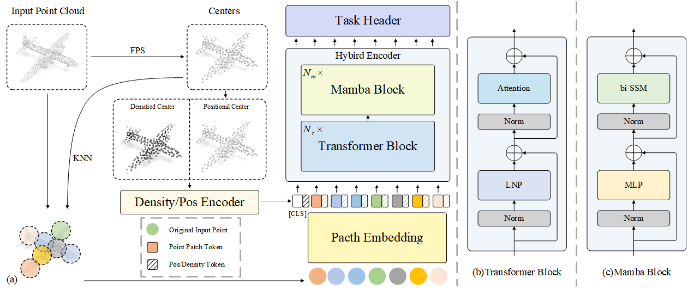

# DTM

This repository contains the official implementation of the paper:

**DTM: Density Embeded Transformer Mamba Hybird Network for Point Cloud Analysis**


##  News
- [2024/12] We release the training and evaluation code! Pretrained weights are coming soon!

<div style="text-align: center">

</div>

##  TODO
- [x] Release the training and evaluation code
- [ ] Release the pretrained weights


##  1. Requirements
Tested on:
PyTorch == 1.13.1;
python == 3.9;
CUDA == 12.0

```
pip install -r requirements.txt
```

```
# Chamfer Distance & emd
cd ./extensions/chamfer_dist
python setup.py install --user
cd ./extensions/emd
python setup.py install --user
# PointNet++
pip install "git+https://github.com/erikwijmans/Pointnet2_PyTorch.git#egg=pointnet2_ops&subdirectory=pointnet2_ops_lib"
# GPU kNN
pip install --upgrade https://github.com/unlimblue/KNN_CUDA/releases/download/0.2/KNN_CUDA-0.2-py3-none-any.whl

# Mamba install
pip install causal-conv1d==1.1.1
```

More detailed settings can be found in [dtm.yaml](./dtm.yaml).

##  2. Datasets 

We use ShapeNet, ScanObjectNN, ModelNet40 and ShapeNetPart in this work. See [DATASET.md](./DATASET.md) for details.


##  3. Training from scratch

To train DTM on ScanObjectNN/Modelnet40 from scratch, run:
```
CUDA_VISIBLE_DEVICES=$GPU_ID python main.py \
--config cfgs/finetune_scan_objbg.yaml \
--scratch_model \
--exp_name DTM_objbg_scratch
```

Few-shot learning, run:
```
CUDA_VISIBLE_DEVICES=$GPU_ID python main.py \
--config cfgs/fewshot.yaml \
--fewshot_model \
--exp_name DTM_fewshot \
--ckpts $PATH_CKPT \
--way 5 \
--shot 10
```


##  Acknowledgement
We would like to thank the authors of [Mamba](https://github.com/state-spaces/mamba), [Mamba 3D](https://github.com/xhanxu/Mamba3D), and [Point-MAE](https://github.com/Pang-Yatian/Point-MAE) for their great works and repos.
